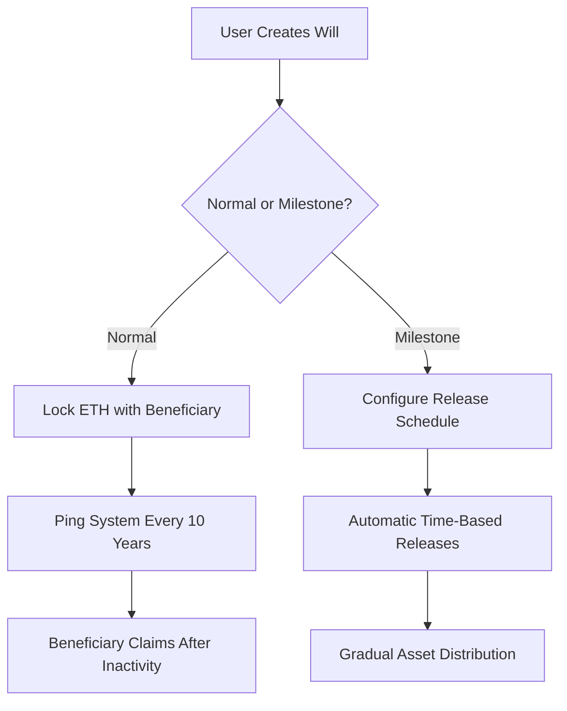

# Inherify - Secure Your Legacy

## Key Features ✨

**🛡️ Dual Will System**
- **Normal Wills**: Single-beneficiary with 10-year inactivity lock
- **Milestone Wills**: Multi-phase distributions with custom triggers

**⏰ Time-Based Automation**
- 10-year activity check (resettable via `ping()`)
- 1-year withdrawal cooldown period
- Milestone-specific release schedules

**🔒 Built-in Protections**
- Immutable beneficiary assignments
- Anti-frontrunning design
- Platform fee collection on creation
- Claim validation safeguards

## Developer Integration 🧐

### Installation
```bash
npm install @openzeppelin/contracts ethers
```

## User Flow Diagram 📊



## Security Architecture 🛡️

1. **Fund Locking**: Assets held in contract until conditions met
2. **Temporal Validation**:
   - 10-year inactivity window for normal wills
   - Time-based milestone releases
   - 1-year withdrawal cooldown
3. **Identity Verification**:
   - Beneficiary ≠ Owner
   - Claimant signature validation
4. **Financial Safeguards**:
   - Percentage-based releases (≤100%)
   - Anti-overclaim protection
   - Platform fee deduction on creation

## Maintenance Operations 🔄

**Withdraw Funds (After 1 Year)**

**Update Beneficiary**

**Reset Activity Timer**

## Contribution Guidelines 🤝

We welcome contributions! Please follow our workflow:
1. Fork repository
2. Create feature branch (`git checkout -b feature/AmazingFeature`)
3. Commit changes (`git commit -m 'Add AmazingFeature'`)
4. Push to branch (`git push origin feature/AmazingFeature`)
5. Open Pull Request

## License 📝

MIT Licensed - See [LICENSE](https://opensource.org/licenses/MIT) for details.

---

**Inherify** - Redefining legacy planning through blockchain technology  


